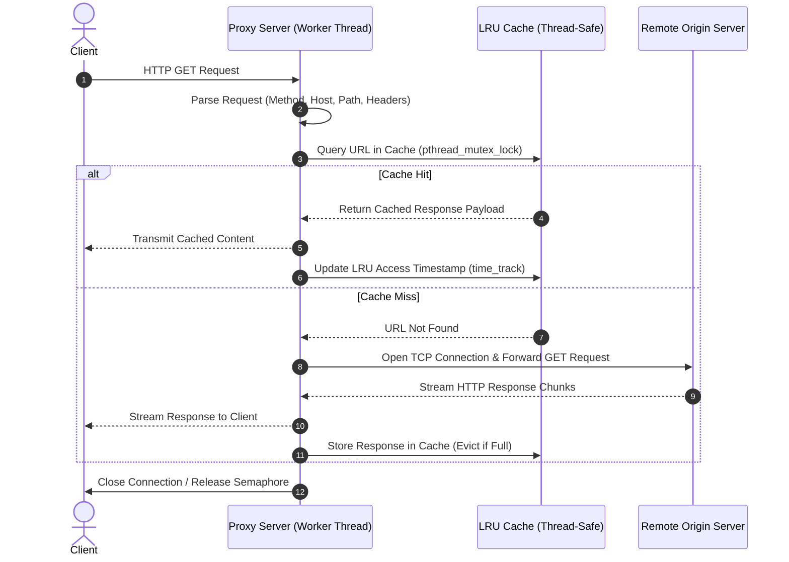

# Multi-Threaded HTTP Proxy Server with LRU Cache

A high-performance, concurrent HTTP proxy server written in **C/C++** utilizing POSIX threads (`pthreads`), counting semaphores for connection throttling, and an in-memory thread-safe **Least Recently Used (LRU)** cache.

---

## Table of Contents
- [Overview](#overview)
- [System Architecture](#system-architecture)
  - [Workflow Diagram](#workflow-diagram)
  - [Concurrency Model](#concurrency-model)
  - [LRU Caching Subsystem](#lru-caching-subsystem)
- [Key Features](#key-features)
- [Project Structure & Implementation](#project-structure--implementation)
  - [Core Components](#core-components)
  - [Key Data Structures](#key-data-structures)
  - [Core Functions](#core-functions)
- [Prerequisites](#prerequisites)
- [How to Build & Run](#how-to-build--run)
  - [1. Compile the Server](#1-compile-the-server)
  - [2. Start the Proxy Server](#2-start-the-proxy-server)
  - [3. Send Test Requests](#3-send-test-requests)
  - [Running Without Cache](#running-without-cache)
- [Demo & Verification](#demo--verification)
- [Error Handling](#error-handling)
- [Limitations & Future Enhancements](#limitations--future-enhancements)

---

## Overview

A **Proxy Server** acts as an intermediary bridge between client devices (such as web browsers or command-line utilities) and origin web servers.

When a client initiates an HTTP request through this proxy:
1. **Interception**: The proxy intercepts and parses the client's HTTP `GET` request.
2. **Cache Inspection**: The server checks its in-memory LRU cache to see if an identical request was already serviced.
   - **Cache Hit**: If found, the cached response is served immediately to the client without reaching out to the target server, drastically cutting network latency and bandwidth.
   - **Cache Miss**: If absent, the proxy establishes a socket connection to the remote origin server, fetches the requested resource, streams the response back to the client, and concurrently saves the response into the LRU cache.
3. **Multi-client Handling**: Concurrently handles up to 400 simultaneous clients through POSIX worker threads and semaphore synchronization.

---

## System Architecture

### Workflow Diagram



### Concurrency Model
- **Master Thread**: Creates a non-blocking TCP socket (`AF_INET`, `SOCK_STREAM`), binds to the user-specified port, sets `SO_REUSEADDR`, and listens for incoming connections.
- **Worker Threads**: For every accepted client connection, a dedicated POSIX thread (`pthread_create`) is dispatched to handle request parsing, cache inspection, and network I/O.
- **Semaphore Throttling**: A counting semaphore (`sem_t seamaphore`) initialized to `MAX_CLIENTS` (400) regulates concurrency. If active requests reach the threshold, incoming connection threads wait until an active worker completes and executes `sem_post`.

### LRU Caching Subsystem
- **Cache Capacity**: Total capacity is capped at `200 MB` (`MAX_SIZE = 200 * (1 << 20)`).
- **Element Size Cap**: Individual elements exceeding `10 MB` (`MAX_ELEMENT_SIZE = 10 * (1 << 20)`) bypass caching to avoid monopolizing memory.
- **Eviction Policy**: When free space is insufficient, `remove_cache_element()` identifies and evicts the node with the minimum `lru_time_track` timestamp until enough space is available.
- **Thread Safety**: All cache operations (`find`, `add_cache_element`, `remove_cache_element`) are protected by a mutex lock (`pthread_mutex_t lock`).

---

## Key Features

- **High Concurrency**: Supports up to 400 simultaneous clients using POSIX threads.
- **Thread-Safe LRU In-Memory Cache**: Automatically caches remote server responses and updates access timestamps.
- **Dynamic Memory Management & Eviction**: Automatically frees least recently accessed elements when memory pressure exceeds limits.
- **Robust HTTP Parser**: Parses standard HTTP requests, extracts headers, validates HTTP versions (`HTTP/1.0` and `HTTP/1.1`), and sanitizes headers (forces `Connection: close`).
- **Standard HTTP Error Responses**: Built-in HTTP response generators for error codes:
  - `400 Bad Request`
  - `403 Forbidden`
  - `404 Not Found`
  - `500 Internal Server Error`
  - `501 Not Implemented`
  - `505 HTTP Version Not Supported`
- **Dual Mode**: Includes both caching (`proxy_server_with_cache.c`) and non-caching (`proxy_server_without_cache.c`) variants for benchmarking and testing.

---

## Project Structure & Implementation

```text
MultiThreadedProxyServerClient/
├── Makefile                      # Build automation script
├── README.md                     # Documentation
├── proxy_parse.h                 # HTTP request & header parser interface
├── proxy_parse.c                 # HTTP parser implementation (state-machine)
├── proxy_server_with_cache.c     # Multi-threaded proxy with LRU cache
├── proxy_server_without_cache.c  # Multi-threaded proxy without cache
└── pics/
    ├── UML.JPG                   # Architecture UML diagram
    └── cache.png                 # Execution and cache hit demonstration
```

### Core Components

1. **`proxy_parse.c` / `proxy_parse.h`**:
   - Parses incoming byte streams into a structured `ParsedRequest` containing HTTP method, host, port, path, HTTP version, and a linked list of `ParsedHeader` key-value pairs.
   - Strips or overrides headers like `Connection: close` and ensures the `Host` header is present.

2. **`proxy_server_with_cache.c`**:
   - **Socket Management**: Initializes server socket on the requested port, accepts client connections, and extracts client IP/port via `inet_ntop`.
   - **Worker Routine (`thread_fn`)**: Receives the raw HTTP request into a 4 KB buffer, checks the cache, queries origin server if necessary, and handles stream relaying.
   - **Cache Engine**: Implements the singly-linked list LRU cache, timestamp updates, and memory deallocation.

### Key Data Structures

```c
// Represents a single cached HTTP response
struct cache_element {
    char* data;               // Cached HTTP response payload
    int len;                  // Payload length in bytes
    char* url;                // Request URL acting as the lookup key
    time_t lru_time_track;    // Timestamp of last access (for LRU eviction)
    cache_element* next;      // Pointer to next element in linked list
};

// Represents a parsed HTTP request (proxy_parse.h)
struct ParsedRequest {
    char *method;             // HTTP Method (e.g., "GET")
    char *protocol;           // Protocol (e.g., "HTTP")
    char *host;               // Target server hostname (e.g., "example.com")
    char *port;               // Target server port (defaults to 80)
    char *path;               // Request path (e.g., "/index.html")
    char *version;            // HTTP version (e.g., "HTTP/1.1")
    struct ParsedHeader *headers; // Linked list of headers
    ...
};
```

### Core Functions

| Function | Description |
| :--- | :--- |
| `find(char* url)` | Searches cache for matching URL; updates `lru_time_track` upon hit under mutex lock. |
| `add_cache_element(...)` | Validates element size, triggers eviction if cache is full, allocates memory, and prepends node to head. |
| `remove_cache_element()` | Traverses the cache linked list to locate and free the node with the oldest timestamp. |
| `connectRemoteServer(...)` | Resolves target hostname using `gethostbyname()`, establishes a TCP socket, and connects to remote host on port 80. |
| `handle_request(...)` | Formats and sends HTTP request to remote server, reads response in chunks, relays bytes to client, and stores response in cache. |
| `sendErrorMessage(...)` | Generates and transmits standard HTML formatted HTTP error status codes (400, 403, 404, 500, etc.). |

---


---

## How to Build & Run

### 1. Compile the Server

Open a terminal in the project directory:

```bash
make all
```

This compiles `proxy_parse.c` and `proxy_server_with_cache.c` and produces an executable named `proxy`.

To clean build artifacts:
```bash
make clean
```

### 2. Start the Proxy Server

Run the executable by passing a port number as an argument (e.g., `8080`):

```bash
./proxy 8080
```

Expected startup output:
```text
Setting Proxy Server Port : 8080
Binding on port: 8080
```

### 3. Send Test Requests

#### Option A: Using `curl` (Recommended)
You can direct `curl` to use your running proxy via the `-x` flag:

```bash
# Request an HTTP website through the proxy
curl -v -x http://localhost:8080 http://neverssl.com/
```

#### Option B: Direct URL Request via Browser
1. Ensure your browser cache is disabled (open Developer Tools -> Network -> Disable cache).
2. Request a standard HTTP URL through the proxy:
   ```text
   http://localhost:8080/http://neverssl.com/
   ```

#### Option C: System/Browser Proxy Configuration
Configure your browser or operating system network proxy settings:
- **Proxy Type**: HTTP Proxy
- **Address / Host**: `127.0.0.1` (or `localhost`)
- **Port**: `8080`

### Running Without Cache

To run the version without caching:
1. Compile directly:
   ```bash
   g++ -g -Wall -o proxy_no_cache proxy_parse.c proxy_server_without_cache.c -lpthread
   ```
2. Run:
   ```bash
   ./proxy_no_cache 8080
   ```

---

